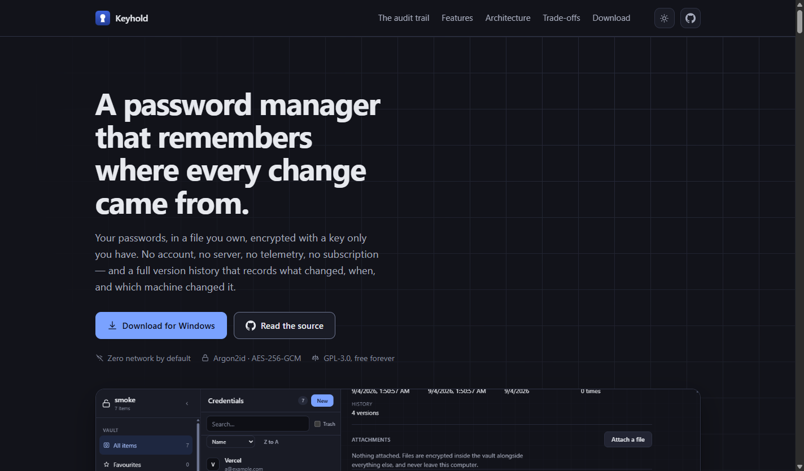
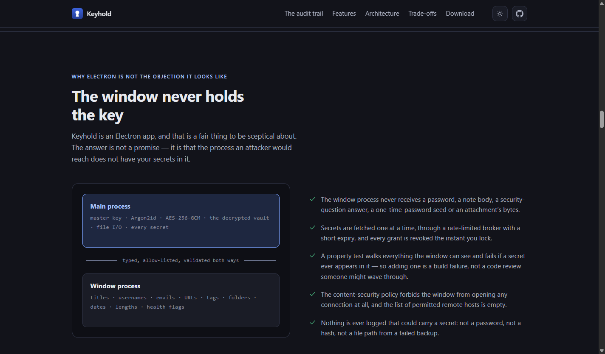
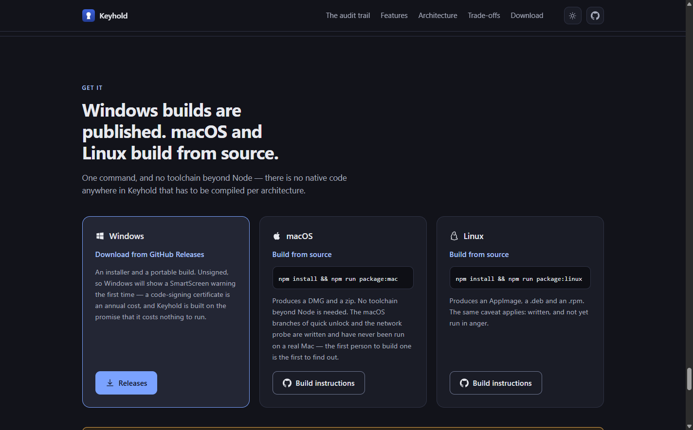

<div align="center">


# Keyhold — Landing Page

**The one-page site for Keyhold, an offline password manager — hand-written CSS over the app's own colour tokens, no framework, no third-party request.**

[](https://react.dev)
[](https://www.typescriptlang.org)
[](https://vite.dev)
[](https://www.gnu.org/licenses/gpl-3.0.en.html)

[](https://anahatmudgal.com)
[](https://github.com/anahatm)

[](https://keyhold.anahatmudgal.com)
[](https://github.com/AnahatM/Keyhold)

</div>

> [!NOTE]
> **Live at [keyhold.anahatmudgal.com](https://keyhold.anahatmudgal.com).** Run it locally with `npm install && npm run dev`.

---

## About

This is the marketing site for [Keyhold](https://github.com/AnahatM/Keyhold), a free, fully offline credential manager. One page: what it is, the audit trail that makes it different, how it is built, what it looks like, where it loses to its competitors, and how to get it.

It is built under the same house rules as the application it advertises — TypeScript in strict mode, hand-written CSS over custom properties, no Tailwind and no CSS-in-JS. That is not a stylistic echo. A site arguing that a password manager should ship almost nothing would be undercutting itself by pulling in a utility framework to draw eleven sections.

**The page loads nothing from anywhere else.** No web font, no analytics, no icon sprite, no CDN — every icon is inline SVG and the type is the system stack. A third-party origin on this page would be able to see who reads about a password manager, which is precisely the leak the product exists to refuse.

## Screenshots

|  |
| :----------------------------------------------------------------------------------: |
|            The first screen — the claim, and the screenshot that backs it            |

|  |  |
| :------------------------------------------------------------------------: | :--------------------------------------------------------------------: |
|            Answering the Electron objection before it is raised            |          The platform split, said plainly rather than implied          |

## Key Features

- **Every claim is sourced** — `src/lib/site.ts` holds all page copy in one place, and every count in it is annotated with the guarded registry in the Keyhold repository it was copied from. Nothing on the page may claim a capability Keyhold does not have; the honest list is the more persuasive one.

- **A trade-offs section, not a hedge** — the page names where KeePassXC, Bitwarden and 1Password are genuinely better, including the missing browser autofill. It is the same table as the app's own README, so the two cannot drift into telling different stories to different audiences.

- **The app's real palette** — Midnight and Dawn, copied from `src/shared/theme/themes.ts` in Keyhold. Dark and light both work; the toggle follows the operating system until the visitor overrides it, and the choice is kept in `localStorage` and nowhere else.

- **Real screenshots, not mockups** — every image is captured by Keyhold's own launch probe driving the real application, and each capture asserts its subject is on screen at the instant it is taken.

- **Readable without JavaScript** — the scroll reveal arms itself from script rather than starting hidden in the stylesheet, so a blocked or failed bundle leaves a fully legible page. There is a real `<noscript>` fallback too. People who block scripts are disproportionately the audience for an offline password manager.

- **A guard for the one thing that fails silently** — `npm run check:assets` fails the build if a referenced screenshot is missing, or if one ships unreferenced. Nothing else would notice a broken image on a static page, and the screenshots are copied in from another repository by hand.

## Usage

```bash
npm install       # install dependencies
npm run dev       # dev server on http://localhost:5173
npm run build     # type-check and build static files to dist/
npm run preview   # serve the production build locally
npm run verify    # format:check + lint + check:assets + build — the whole gate
```

### Updating the screenshots

They come from the Keyhold repository, generated rather than taken by hand:

```bash
cd ../Keyhold
npm run build && node tools/smoke.mjs --shots docs/images
cp docs/images/*.png ../Keyhold-Landing-Page/public/screenshots/
```

Then run `npm run check:assets` — it will tell you if a filename moved and the page still points at the old one.

## Deployment

Static files, so any host works. `vercel.json` sets the build command, the output directory
and the response headers — a content-security policy matching the page's own promise (it
loads nothing from a third party, so `default-src 'self'` and `connect-src 'none'` cost
nothing), plus `nosniff`, `no-referrer`, a `Permissions-Policy` that denies every sensor, and
long cache lifetimes on the hashed asset bundle.

**The site is live at [keyhold.anahatmudgal.com](https://keyhold.anahatmudgal.com).** That
origin appears three times in `index.html` — `<link rel="canonical">`, `og:url` and
`og:image` — and once each in `public/robots.txt` and `public/sitemap.xml`. They are
duplicated rather than templated, and that is only safe because `npm run check:assets` fails
the build when the three in `index.html` disagree. **If the domain ever moves, change all
five**; a canonical pointing at a domain that does not serve the page is worse than none at
all.

`og:image` must stay **absolute**. Open Graph resolves nothing relative, so a path there
means every link to this page — Slack, Discord, X, iMessage — renders a card with no
picture, silently, while the page itself looks perfect. That was a real defect here, and the
asset check now refuses it.

## Project Structure

| Path                     | What it holds                                                                      |
| ------------------------ | ---------------------------------------------------------------------------------- |
| `src/lib/site.ts`        | Every fact, link and piece of copy on the page. Start here                         |
| `src/index.css`          | Design tokens and the whole visual system. Zero hardcoded colours below the tokens |
| `src/components/`        | One component per section, in the order they appear                                |
| `src/components/ui/`     | `Section`, `Logo`, `ScreenshotFrame` — the three shared pieces                     |
| `src/hooks/`             | `useReveal` (scroll reveal that fails visible) and `useTheme`                      |
| `tools/check-assets.mjs` | The build guard for referenced-vs-shipped images                                   |
| `public/screenshots/`    | Copied from Keyhold's `docs/images/`                                               |

## Built With


Two runtime dependencies, `react` and `react-dom`. Nothing else reaches the browser.

## Author

**Anahat Mudgal**

- Website: [anahatmudgal.com](https://anahatmudgal.com)
- GitHub: [@AnahatM](https://github.com/anahatm)
- The application: [github.com/AnahatM/Keyhold](https://github.com/AnahatM/Keyhold)

## License

GPL-3.0-or-later, the same as Keyhold itself. See [the licence text](https://www.gnu.org/licenses/gpl-3.0.en.html).
